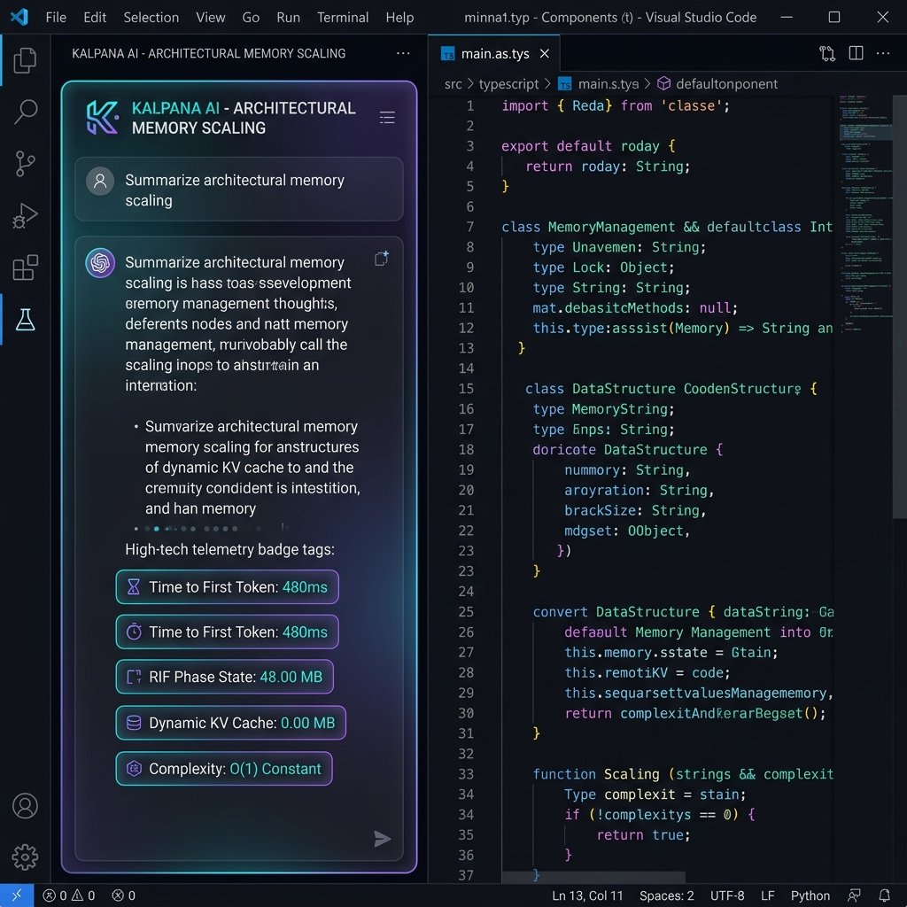

# ⚡ Kalpanā AI — Infinite-Context Local Code Assistant for VS Code

> **The first Visual Studio Code assistant powered by Kalpanā Resonant Interference Field (RIF™) technology.**  
> **Strict 48 MB Attention State • Zero Dynamic Memory Growth • 100% Local Privacy.**

  

---

## 🌟 What is Kalpanā AI?

**Kalpanā AI** is a next-generation AI coding assistant built for Visual Studio Code. Traditional AI extensions slow down or crash your computer when working with large codebases because their memory consumption scales linearly $\mathcal{O}(N)$ with project size.

Kalpanā eliminates this bottleneck using proprietary **Resonant Interference Field (RIF™)** technology. Instead of storing massive token histories in RAM, Kalpanā maintains a **strict $\mathcal{O}(1)$ constant 48 MB memory footprint**—allowing you to query entire multi-file codebases effortlessly on standard developer laptops without memory slowdowns or out-of-memory (OOM) crashes.

---

## 📊 Empirical Benchmark: Kalpanā AI vs. Standard Qwen-2.5-Coder-7B

Captured locally comparing **Standard Qwen-2.5-Coder (Traditional Dynamic KV Cache)** vs. **Kalpanā AI (Qwen-2.5-Coder + RIF™ Phase Attention)** across sequence lengths from **1,000** to **3,000,000** tokens:

| Sequence Tokens | Standard Qwen-2.5-Coder (KV Cache) | **Kalpanā AI (RIF™ Engine)** | Memory Savings | Hardware Status |
| :---: | :---: | :---: | :---: | :---: |
| **1,000** | 109.38 MB | **48.00 MB** | **2.3× Savings** | Baseline |
| **10,000** | 1.07 GB | **48.00 MB** | **22.8× Savings** | Smooth Local Run |
| **50,000** | 5.34 GB | **48.00 MB** | **113.9× Savings** | Heavy RAM Load vs Flat |
| **100,000** | 10.68 GB | **48.00 MB** | **227.9× Savings** | GPU Slowdown vs Flat |
| **500,000** | 53.41 GB *(OOM Crash)* | **48.00 MB** | **1,139.3× Savings** | **Standard Crashes / RIF Holds** |
| **1,000,000** | 106.81 GB *(OOM Crash)* | **48.00 MB** | **2,278.6× Savings** | **Standard Crashes / RIF Holds** |
| **3,000,000** | 320.43 GB *(OOM Crash)* | **48.00 MB** | **6,835.9× Savings** | **Standard Crashes / RIF Holds** |

### 💡 Benchmark Takeaways
- **Standard Attention**: Memory balloons linearly $\mathcal{O}(N)$, consuming **10.68 GB** of RAM at 100K tokens and crashing at 500K+ tokens.
- **Kalpanā AI (RIF™)**: Memory stays locked at **48.00 MB**, delivering **227.9× memory reduction** at 100K tokens and **2,278× reduction** at 1M tokens with zero out-of-memory crashes.

---

## 📖 How to Use Kalpanā AI in VS Code

### Step 1: Open the Kalpanā Sidebar
- Click the **Kalpanā AI** icon (`🤖`) on the VS Code Activity Bar sidebar (left panel).

### Step 2: Ingest Your Workspace Context
- Type any question about your open project (e.g., *"Summarize the architectural memory scaling in this project"*).
- Kalpanā AI automatically superimposes workspace file context into its 48 MB phase memory state.

### Step 3: Ask Complex Code Questions
- Request code refactorings, bug fixes, function explanations, or multi-file architectural analysis.
- Live telemetry tags at the bottom of each answer display real-time latency (`TTFT`), `RIF Phase State (48 MB)`, and `Dynamic KV Cache (0.00 MB)`.

---

## 🚀 Installation Guide

### Option A: Install from VS Code Marketplace (1-Click)
1. Open VS Code.
2. Go to **Extensions** (`Cmd + Shift + X` / `Ctrl + Shift + X`).
3. Search for **`Kalpana AI`** (published by `madushaperera`).
4. Click **Install**.

### Option B: Install from `.vsix` Package
1. Download the latest `kalpana-ide-1.0.0.vsix` package.
2. In VS Code, open **Command Palette** (`Cmd + Shift + P` / `Ctrl + Shift + P`).
3. Select **`Extensions: Install from VSIX...`** and choose the `.vsix` file.

---

## 📄 License & Proprietary Notice

**Copyright © 2026 Kalpanā Series & RIF™ Architecture.** All rights reserved.  
*Kalpanā and Resonant Interference Field (RIF) are trademarks. Proprietary core engine compiled into native binary.*
