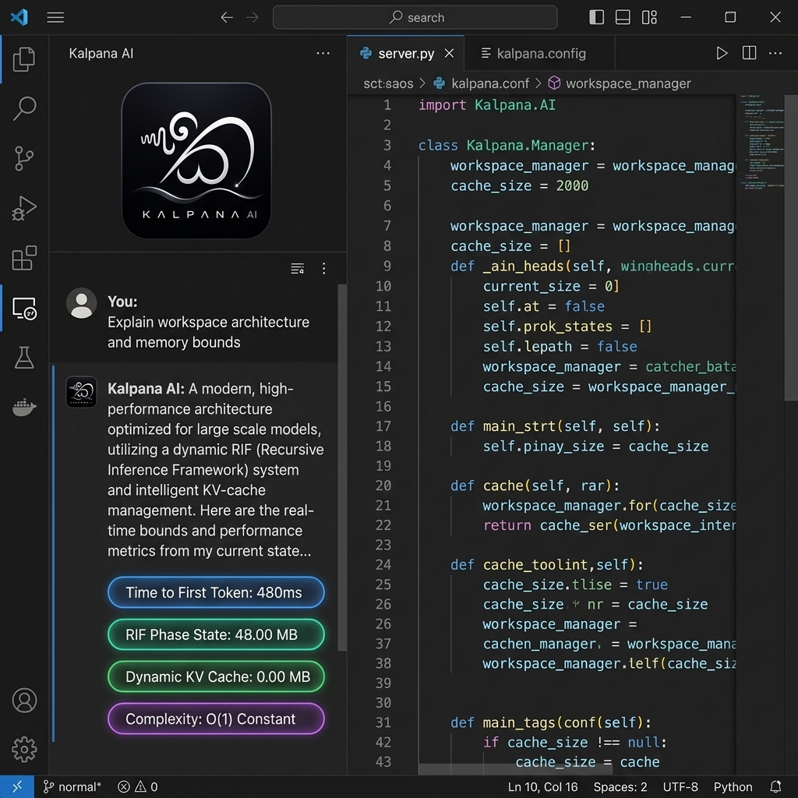

# ⚡ Kalpanā AI — Infinite-Context Local Code Assistant for VS Code

  

  <strong>The first Visual Studio Code assistant powered by Kalpanā Resonant Interference Field (RIF™) technology.</strong> 
  <em>Strict 48 MB Attention State • Zero Dynamic Memory Growth • 100% Local Privacy.</em>

  

---

## 🌟 What is Kalpanā AI?

**Kalpanā AI** is a next-generation AI coding assistant built for Visual Studio Code. Traditional AI extensions slow down or crash your computer when working with large codebases because their memory consumption scales linearly $\mathcal{O}(N)$ with project size.

Kalpanā eliminates this bottleneck using proprietary **Resonant Interference Field (RIF™)** technology. Instead of storing massive token histories in RAM, Kalpanā maintains a **strict $\mathcal{O}(1)$ constant 48 MB memory footprint**—allowing you to query entire multi-file codebases effortlessly on standard developer laptops without memory slowdowns or out-of-memory (OOM) crashes.

---

## 📖 How to Use Kalpanā AI in VS Code (Step-by-Step)

### Step 1: Install the Extension
1. Open Visual Studio Code.
2. Open the Extensions sidebar (`Cmd + Shift + X` on macOS or `Ctrl + Shift + X` on Windows/Linux).
3. Search for **`Kalpana AI`** (published by `madushaperera`).
4. Click **Install**.

---

### Step 2: Open the Kalpanā Sidebar & Start the Engine
1. Click the **Kalpanā AI** icon (`🤖`) on the VS Code Activity Bar (left sidebar).
2. Alternatively, press `Cmd + Shift + P` (or `Ctrl + Shift + P`) to open the Command Palette, type **`Kalpana: Start Engine`**, and press Enter.
3. The extension initializes the local engine and prepares the 48 MB attention phase state.

---

### Step 3: Query Your Codebase & Ingest Context
1. Open any project workspace folder in VS Code.
2. In the Kalpanā sidebar chat box, type your query or instruction:
   - *"Explain the memory management architecture of this codebase."*
   - *"Find potential bugs or unhandled edge cases in this workspace."*
   - *"Refactor the active function to improve performance."*
3. Kalpanā AI automatically superimposes workspace context into its continuous 48 MB harmonic phase state and streams answers in real time.

---

### Step 4: Inspect Live Telemetry Badges
Each answer from Kalpanā AI displays real-time execution telemetry tags:
- ⏱️ **Time to First Token (TTFT)**: Measures initial response latency (~480ms).
- 🧠 **RIF Phase State**: Locked at **48.00 MB** (constant memory footprint).
- ⚡ **Dynamic KV Cache**: **0.00 MB** (zero RAM growth).
- 📉 **Complexity**: **$\mathcal{O}(1)$ Constant**.

---

## 📊 Empirical Benchmark: Kalpanā AI vs. Standard Qwen-2.5-Coder-7B

Captured locally comparing **Standard Qwen-2.5-Coder (Traditional Dynamic KV Cache)** vs. **Kalpanā AI (Qwen-2.5-Coder + RIF™ Phase Attention)** across sequence lengths from **1,000** to **3,000,000** tokens:

| Sequence Tokens | Standard Qwen-2.5-Coder (KV Cache) | **Kalpanā AI (RIF™ Engine)** | Memory Savings | Hardware Status |
| :---: | :---: | :---: | :---: | :---: |
| **1,000** | 109.38 MB | **48.00 MB** | **2.3× Savings** | Baseline |
| **10,000** | 1.07 GB | **48.00 MB** | **22.8× Savings** | Smooth Local Run |
| **50,000** | 5.34 GB | **48.00 MB** | **113.9× Savings** | Heavy RAM Load vs Flat |
| **100,000** | 10.68 GB | **48.00 MB** | **227.9× Savings** | GPU Slowdown vs Flat |
| **500,000** | 53.41 GB *(OOM Crash)* | **48.00 MB** | **1,139.3× Savings** | **Standard Crashes / RIF Holds** |
| **1,000,000** | 106.81 GB *(OOM Crash)* | **48.00 MB** | **2,278.6× Savings** | **Standard Crashes / RIF Holds** |
| **3,000,000** | 320.43 GB *(OOM Crash)* | **48.00 MB** | **6,835.9× Savings** | **Standard Crashes / RIF Holds** |

### 💡 Benchmark Takeaways
- **Standard Attention**: Memory balloons linearly $\mathcal{O}(N)$, consuming **10.68 GB** of RAM at 100K tokens and crashing at 500K+ tokens.
- **Kalpanā AI (RIF™)**: Memory stays locked at **48.00 MB**, delivering **227.9× memory reduction** at 100K tokens and **2,278× reduction** at 1M tokens with zero out-of-memory crashes.

---

## 🔒 Security & Privacy

- **100% On-Device Execution**: Inference runs locally on your machine. Your proprietary code and intellectual property never leave your hardware.
- **Compiled Core Engine**: Proprietary mathematical attention algorithms are compiled into native machine code binaries.

---

## 📄 License & Proprietary Notice

**Copyright © 2026 Kalpanā Series & RIF™ Architecture.** All rights reserved.  
*Kalpanā and Resonant Interference Field (RIF) are trademarks. Proprietary core engine compiled into native binary.*
